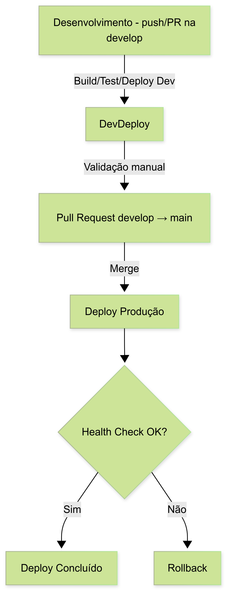

# 📦 Documentação de CI/CD com GitHub Actions

Este projeto utiliza uma pipeline CI/CD com GitHub Actions para automatizar os processos de build, validação e deploy em diferentes ambientes: desenvolvimento, validação e produção.

---

## 🛠️ Ambientes

### 1. Desenvolvimento (`local`)
- **Acionado em qualquer push ou PR na branch `develop`**.
- Etapas:
    - Build da aplicação com Maven.
    - Execução dos testes automatizados.
    - Deploy automático na VPS em modo de desenvolvimento (`--spring.profiles.active=local`), escutando na porta 8081.

### 2. Validação / Promoção para Produção
- **Acontece via Pull Request da branch `develop` para `main`**.
- Etapas:
    - Build e execução dos testes.
    - Análise de código com checkstyle do maven, por padrão configurado o style do `google`.
    - Validação do pipeline (CI).
    - _Não_ realiza deploy neste momento, apenas valida se o código pode ir para produção.

### 3. Produção (`prod`)
- **Acionado automaticamente após merge na branch `main`**.
- Etapas:
    - Build com Maven e empacotamento do JAR.
    - Envio do artefato para a VPS via `scp`.
    - Encerramento da versão antiga (parando o processo anterior).
    - Execução do novo JAR em `tmux`, com perfil `prod`.
    - Verificação de health check com `/actuator/health`.
    - Caso o health check falhe (status diferente de 200), um novo workflow de rollback é disparado automaticamente via API do GitHub.

---

## 🔁 Mecanismo de Rollback

### Objetivo
Evitar que o sistema fique inoperante ao implantar uma versão com falha em produção.

### Estratégia
- Antes de fazer o deploy, a versão anterior do JAR é movida para `/home/ubuntu/backup/`.
- Após o deploy, o sistema aguarda 15 segundos e verifica o endpoint de health.
- Se falhar (HTTP diferente de 200):
    - Um workflow separado (`rollback.yml`) é acionado via `curl` para restaurar a versão anterior.

### Segurança
- O token `GITHUB_TOKEN` é usado com permissão para disparar outros workflows de forma segura.

---

## 📊 Justificativas Técnicas

### GitHub Actions
- Facilidade de integração com GitHub.
- Token automático (`GITHUB_TOKEN`) para autenticação segura entre workflows.
- Estrutura de jobs permite controle granular dos passos e execuções condicionais.

### SSH + SCP com `sshpass`
- Simples para deploy em VPS Linux.
- Evita configuração de chave pública/privada (usando senha segura via secrets).

### Tmux
- Permite manter a aplicação executando mesmo após desconexão da sessão SSH.
- Gerenciamento simples com `tmux kill-session` e `tmux new-session`.

### Health Check com `/actuator/health`
- Endpoint padrão do Spring Boot para verificação de status.
- Automatiza a validação pós-deploy.

---

## 🔄 Fluxo Resumido

---

## 📁 Estrutura de Workflows

- `.github/workflows/dev.yml` → Deploy automático para ambiente local.
- `.github/workflows/validate.yml` → Build e validação do PR para produção.
- `.github/workflows/prod.yml` → Deploy automatizado em produção com health check.
- `.github/workflows/rollback.yml` → Restaurar a versão anterior se falhar o health.

## Como configurar essa pipeline para um projeto 👷

...
---
